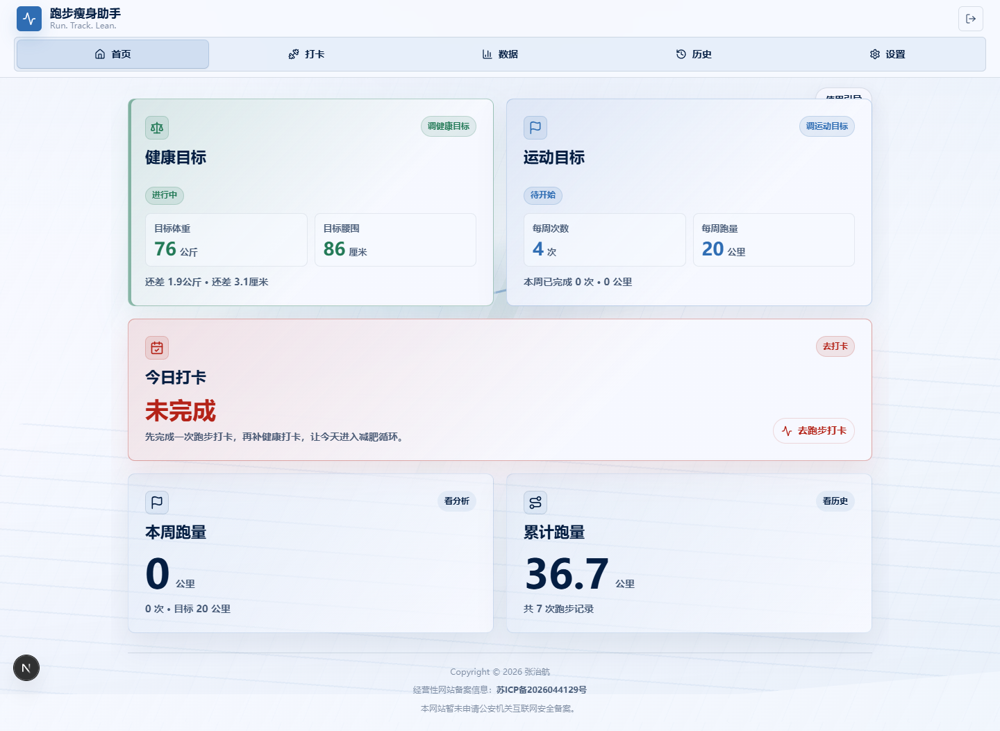

# SlimmingAssistant 瘦身助手

SlimmingAssistant 是一个面向个人私有使用的 Web 健康管理助手。它的核心目的不是替代专业运动平台，而是把减脂过程中最容易断掉的一条链路补起来：集中记录每日健康数据和跑步数据，用趋势、目标差距和提醒机制给自己持续反馈，降低“忘记记录、懒得运动、看不到进步就放弃”的概率。

产品闭环可以概括为：

```text
设置目标 -> 每日记录 -> 查看趋势和目标差距 -> 收到提醒 -> 继续行动
```

## 项目状态

当前项目是面向个人和小范围私有使用的 MVP，已经覆盖轻量账号隔离、健康/跑步记录、目标管理、首页仪表盘、历史记录、提醒配置和宝塔部署流程。当前账号体系支持管理员、普通用户和访客模式，但不是面向公网开放注册的 SaaS；如果要公开部署，需要先补齐更完整的认证、授权、备份和隐私保护方案。

## 核心功能

- **访问保护**：支持管理员、普通用户和访客模式；普通用户数据互相隔离，访客只做临时体验；已验证浏览器会作为受信设备保存。
- **今日记录**：录入当天健康记录和跑步记录。健康记录按自然日唯一保存，同一天重复提交会覆盖当天记录；跑步记录按单次运动保存，同一天可以有多条。
- **健康数据管理**：记录体重、腰围、臀围、体脂率，并结合身高计算 BMI 展示。
- **跑步数据管理**：记录跑步距离、时长、配速、平均心率、平均步幅、步频等指标。
- **历史记录**：按类型和时间范围查看健康记录、跑步记录，支持补录、编辑和删除。
- **目标管理**：设置健康目标和跑步目标，例如目标体重、目标围度、每周跑步次数、每周跑量。
- **首页仪表盘**：展示今日状态、健康目标、运动目标、趋势曲线、预计达成时间和鼓励反馈。
- **提醒与配置**：配置个人资料、站内提醒、邮件提醒、SMTP 参数、趋势估算阈值、登录密码和受信设备。

## 产品与交互约定

这些约定来自实际部署和使用反馈，后续修改时需要优先保持一致，避免同类问题反复出现：

- 首页第一屏目标区固定为两张卡片：**健康目标**（目标体重、目标腰围）和 **运动目标**（每周跑步次数、每周跑量）。不要再拆回“目标体重 / 目标腰围”两张独立卡片。
- 目标状态配色保持克制和可区分：未设置用蓝灰中性提示；健康目标已设置或达成用翠绿色系；运动目标已设置或达成用运动蓝色系；今日打卡未完成用红色，完成用翠绿色。
- 登录页和首次创建管理员页必须保留鼠标移动、点击反馈的运动背景；登录后的所有主导航页都应共享全视口运动背景和鼠标跟随效果，不只局限在首页或中间内容容器中；动效必须尊重 `prefers-reduced-motion`。
- 每日提醒时间使用“小时 / 分钟”两个下拉框，分钟支持 `0-59`，提交后仍保存为 `HH:mm`。
- 邮件发信 SMTP 只由管理员维护；普通用户只维护自己的提醒收件邮箱，并可以发送测试邮件。
- 邮件提醒不能用“同一用户同一天已有任意邮件事件”作为全局阻断。提醒事件按提醒时间区分；用户调整提醒时间或收件邮箱后，应允许当天重新触发。
- 管理员创建用户时的显示名称是该用户默认昵称；用户后续可在设置中修改昵称。
- 访客模式只用于临时体验，数据仅保存在本次前端会话，不写入持久数据库；访客不能进入设置页。
- 打卡页的体重、围度、体脂率、跑步距离、时长、心率、步幅、步频必须使用带 `min` / `max` / `step` 的数值输入，并在前端显示常规范围提示；不要使用 0.1 粒度的超长下拉框，也不要退回可随意输入字符串的文本框。后端必须同步校验同一套范围。

## 界面预览

### 登录界面


### 首页



## 技术栈

- Next.js 16 + React 19
- TypeScript 6
- SQLite + Drizzle ORM
- Tailwind CSS 4
- Nodemailer
- better-sqlite3
- lucide-react
- Node.js 内置测试运行器

## 本地运行

### 环境要求

- Node.js >= 24.0.0
- npm

### 安装依赖

```bash
npm install
```

### 初始化或迁移数据库

默认数据库路径为 `data/slimming-assistant.sqlite`。部署准备阶段会执行迁移；如果希望手动迁移，可以运行：

```bash
npm run db:migrate
```

如需指定 SQLite 文件位置，可以设置 `SQLITE_PATH`：

```bash
SQLITE_PATH=./data/local.sqlite npm run db:migrate
```

### 启动开发服务

```bash
npm run dev
```

启动后打开 Next.js 输出的本地地址。首次访问会进入管理员账号创建流程。

## 常用命令

```bash
npm run dev          # 启动开发服务
npm run build        # 构建生产版本
npm run start        # 启动生产服务，默认监听 0.0.0.0:3000
npm run prepare:bt   # 宝塔部署准备：安装生产依赖并迁移数据库，执行完会退出
npm run start:bt     # 宝塔启动入口，只启动生产服务，默认监听 0.0.0.0:3000
npm run start:bt:3001 # 宝塔启动入口，固定监听 0.0.0.0:3001
npm run release      # 本地构建并生成 Linux 服务器发布包
npm run check        # 依次运行 lint、typecheck 和 test
npm run lint         # 运行 ESLint
npm run typecheck    # 生成 Next 类型并执行 TypeScript 检查
npm run test         # 运行单元测试
npm run db:generate  # 根据 schema 生成 Drizzle 迁移
npm run db:migrate   # 执行数据库迁移
npm run ui:screenshot # 生成本地 UI 截图
```

## 生产部署

完整部署和排障流程见 [部署手册](doc/deployment-manual.md)。这里保留常用部署步骤。

推荐在本地或 CI 构建发布包。服务器只负责安装生产依赖、迁移数据库和启动服务，并且要把“部署准备”和“宝塔启动命令”分开执行。

不要把 `npm install`、`npm run build`、`npm run prepare:bt` 放进宝塔启动命令。宝塔会在重启、守护拉起或开机时反复执行启动命令，小内存服务器可能因此被依赖安装或原生模块编译打满，表现为 SSH 无响应。

本地或 CI 执行：

```bash
npm install
npm run release
```

上传 `dist/releases/*.tar.gz` 到服务器并解压，例如：

```bash
mkdir -p /www/wwwroot/slimming-assistant
tar -xzf slimming-assistant-*.tar.gz -C /www/wwwroot/slimming-assistant --strip-components=1
cd /www/wwwroot/slimming-assistant
```

首次部署或更新依赖后，在 SSH 里手动执行一次部署准备：

```bash
npm run prepare:bt
```

`prepare:bt` 会执行：

- 首次部署或依赖变化时执行 `npm install --omit=dev`
- 执行 `npm run db:migrate`
- 准备 Next.js 运行时需要的 `better-sqlite3` alias
- 执行完成后退出，不会启动长驻服务

然后在宝塔项目的启动命令里只填写：

```bash
npm run start:bt:3000
```

这个命令只启动生产服务并监听 `0.0.0.0:3000`，不会安装依赖，也不会执行构建。

### 邮件提醒自动任务

生产环境必须通过 `npm run start:bt` 或 `npm run start:bt:3000` 启动，邮件提醒才会自动执行。启动脚本会在进程内生成 `INTERNAL_REMINDER_TOKEN`，每分钟调用一次受保护的内部接口 `/api/reminders/run`，逐个检查未停用用户的提醒规则。

邮件提醒发送逻辑：

- 管理员在“设置 -> SMTP 邮件”维护全局发信服务器。
- 每个用户在“设置 -> 邮件接收”维护自己的提醒收件邮箱，并可点击“发送测试邮件”验证。
- 用户开启“提醒规则 -> 邮件提醒”后，到达提醒时间且当天健康记录或跑步记录缺失时，后台任务会发送提醒邮件。
- 邮件提醒事件按提醒时间生成去重键；如果用户当天调整提醒时间或收件邮箱，系统会清理当天邮件提醒事件，允许新的提醒再次发送。

可选环境变量：

```bash
REMINDER_CHECK_INTERVAL_MS=60000   # 默认每 60 秒检查一次，最小 10000
REMINDER_TIME_ZONE=Asia/Shanghai   # 默认按中国时区计算提醒日期和时间
REMINDER_CHECK_DISABLED=1          # 临时关闭后台提醒检查
```

如果宝塔前面启用了 HTTPS 反向代理，推荐在站点的 Nginx 反向代理配置里保留这些请求头，避免 Next.js Server Actions 因 `Origin` 和 `X-Forwarded-Host` 不一致而拒绝提交：

```nginx
proxy_set_header Host $host;
proxy_set_header X-Forwarded-Host $host;
proxy_set_header X-Forwarded-Proto $scheme;
proxy_set_header X-Forwarded-Port $server_port;
```

项目的 `start:bt` 入口也会在请求进入 Next.js 前自动去掉 `X-Forwarded-Host` / `Host` 里的默认端口，例如把 `www.hangge.xyz:443` 规范为 `www.hangge.xyz`。如果将来有多个公网域名，构建发布包前可以设置：

```bash
SERVER_ACTION_ALLOWED_ORIGINS=www.hangge.xyz,hangge.xyz npm run release
```

如果宝塔无法配置环境变量，并且需要改端口，可以直接使用固定端口脚本：

```bash
npm run start:bt:3001
```

或者在启动脚本后追加参数：

```bash
node scripts/start-bt.mjs --port 3001
```

### 宝塔部署检查

启动后在服务器上检查：

```bash
curl http://127.0.0.1:3000
ss -lntp | grep :3000
```

如果本机 `curl` 正常但外网打不开，优先检查宝塔反向代理、端口放行、安全组和防火墙。

### SSH 被卡死时的处理

如果误把 `npm run start:bt` 的旧版本或 `npm install` 放进宝塔启动命令，导致 SSH 无响应，先从云厂商控制台的 VNC/救援终端进入服务器，然后执行：

```bash
pkill -9 -f "npm install"
pkill -9 -f "boot-bt.mjs"
pkill -9 -f "start-bt.mjs"
pkill -9 -f "next start"
```

再检查资源：

```bash
top
free -h
df -h
```

小内存服务器建议先加 swap，再执行 `npm run prepare:bt`：

```bash
fallocate -l 2G /swapfile
chmod 600 /swapfile
mkswap /swapfile
swapon /swapfile
echo '/swapfile none swap sw 0 0' >> /etc/fstab
```

## 目录结构

```text
app/          Next.js App Router 页面与布局
components/   通用 UI 和布局组件
features/     按业务领域组织的组件、服务、仓储和 actions
db/           SQLite/Drizzle schema、客户端和迁移文件
lib/          通用工具函数
scripts/      数据库迁移、截图等辅助脚本
tests/        Node.js 测试用例
doc/          原始需求说明
docs/         项目文档
```

## 数据与隐私边界

SlimmingAssistant 当前按个人或小范围私有使用设计。健康记录、跑步记录、目标和提醒配置都保存在本地 SQLite 数据库中；管理员、普通用户和访客模式用于轻量访问隔离，不等同于面向公网开放注册的完整认证系统。

如果要公开部署、大规模多人使用或保存更敏感的数据，需要重新评估认证、授权、密钥管理、备份和传输安全方案。

## 当前不做的事情

- 不做公开注册、社交、排行榜或好友监督。
- 不做手表、跑步 App、体脂秤或第三方平台自动同步。
- 不做短信、微信、QQ 推送。
- 不做 AI 健身教练、饮食处方、疾病管理或医疗建议。

## 项目目标

这个项目优先服务一个朴素但明确的目标：让个人减脂和跑步记录变得足够集中、足够低摩擦、足够有反馈。只要每天能快速记录、首页能看懂自己离目标还有多远、忘记行动时能被提醒，SlimmingAssistant 就完成了第一阶段的价值。
## License

This project is licensed under the MIT License. See [LICENSE](LICENSE) for details.

Unless otherwise noted, third-party dependencies, assets, course/tutorial materials, and externally sourced resources remain under their original licenses.
